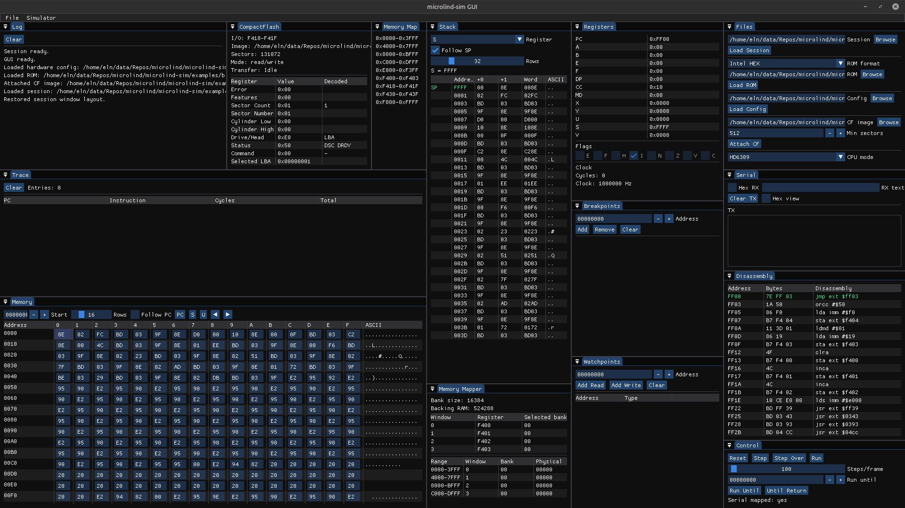

# microlind-sim

C++ HD6309/MC6809 simulator for the microLind system, with a pluggable bus,
hardware configuration, parsed PLD decode logic, CLI tools, and an ImGui/SDL
debugger GUI.



## Structure
- `include/microlind/` public headers for bus, CPU, clock, simulator, devices,
  app-layer helpers, and PLD logic support.
- `src/` implementations.
- `src/devices/` RAM/ROM, banked RAM, memory mapper, serial, IRQ controller,
  and CompactFlash devices.
- `src/cli/` interactive CLI, image loading, hardware config parsing, and
  simulator setup.
- `src/gui/` ImGui/SDL debugger GUI.
- `docs/` hardware config, PLD logic plan, and reference material.

## Build
```
cmake -S . -B build
cmake --build build
```
Run the CLI:
```
./build/microlind-sim-cli --6309 --rom path/to/bios.rom
./build/microlind-sim-cli --6309 --ihex --rom bios.hex
./build/microlind-sim-cli --6309 --srec --rom bios.s19
```

## GUI
An experimental Dear ImGui/SDL GUI is available as a separate executable beside
the CLI. It is disabled by default so the core simulator can still build without
GUI dependencies installed.

To build it, install SDL2 development files. CMake will fetch Dear ImGui into
the build tree:

```
cmake -S . -B build -DMICROLIND_BUILD_GUI=ON
cmake --build build --target microlind-sim-gui
```

You can use a local Dear ImGui checkout instead with
`-DMICROLIND_IMGUI_DIR=/path/to/imgui`, or change the fetched branch/tag with
`-DMICROLIND_IMGUI_GIT_TAG=...`.

The GUI is a simulator workbench with text path fields and browse dialogs for
ROM, hardware config, and CF image loading. It includes run, pause, reset,
instruction step, micro-step, step-over, run-until-address, run-until-return,
and rate-limited Run controls. The run rate is configured as operations per
minute and displayed as operations per second; Run can execute either full
instructions or individual micro-steps. A True Run mode can target 1, 2, or
3 MHz while pausing debugger panel refresh and keeping peripherals such as
serial active.

Debugger panels include registers, flags, disassembly with instruction bytes,
editable memory, stack inspection, serial RX/TX, breakpoints, watchpoints,
editable memory-mapper registers, instruction trace, mapped-device display,
CompactFlash state, live PLD/bus decode, and an event log. The trace window is
updated for both regular stepping and completed micro-stepped instructions.

## Hardware config
`examples/hw.cfg` maps the current microLind memory and I/O layout: ROM, RAM,
XR88C92 serial, CompactFlash, memory mapper windows, board IRQ register, and
optional PLD logic routing. See [docs/hardware-config.md](docs/hardware-config.md)
for the full syntax.

A minimal CompactFlash section looks like:

```
[CF]
IO_START_ADDRESS=0xF418
IO_END_ADDRESS=0xF41F
SECTORS=2048
IMAGE=cf.img
READ_ONLY=false
```

`IMAGE`, `SECTORS`, and `READ_ONLY` are optional. Without an image path, the CF
device uses volatile zero-filled storage. With `IMAGE`, the image size becomes
the disk size unless `SECTORS` is set as a larger minimum. The current model
implements the 8-byte ATA/CF register window, `IDENTIFY DEVICE`, PIO read/write
sector commands, read/write multiple, erase sectors, read verify, set features,
set multiple mode, diagnostics, and common idle/standby/check-power commands.

Raw disk images, such as files created with `dd`, can also be loaded at runtime:

```
loadcf path/to/cf.img
loadcf path/to/cf.img 4096
```

The optional sector count is a minimum size. Images that are not an exact multiple of 512 bytes are padded to the next sector.

### PLD logic
`hw.cfg` may optionally reference the board PLD source files. Relative paths are
resolved from the config file location:

```
[PLD_LOGIC]
SIGNAL_LOGIC=signal-logic.pld
MEMORY_LOGIC=mem-logic.pld
ADDRESS_LOGIC=address-logic.pld
BUS_MODE=route
```

When this section is present, simulator rebuilds validate configured ROM, RAM,
memory mapper, CompactFlash, and serial ranges against the decoded PLD logic.
The CLI prints validation diagnostics; GUI/session rebuilds add them to the
event log.

`BUS_MODE` controls how decoded PLD selects interact with the simulator bus:
`validate` keeps the normal range map and logs mismatches, `route` uses the PLD
selected device role for bus accesses, and `range` disables live PLD bus decode.
The example config uses `route`.

Two CLI commands are available for visual validation:

```
pldcfg examples/signal-logic.pld examples/mem-logic.pld examples/address-logic.pld
pldcheck examples/hw.cfg examples/signal-logic.pld examples/mem-logic.pld examples/address-logic.pld
```

`pldcfg` prints a partial `hw.cfg` generated from decoded PLD address ranges.
`pldcheck` validates an existing hardware config against the PLD decode. The
current parser supports the WinCUPL subset used by the project PLDs, including
`PIN` declarations, active-low `!` names, simple sum-of-products equations, and
binary/hex constants. Parsed active-low outputs are exposed as asserted logical
signals. See `docs/logic-plan.md` for details and parser limits.

## Current CPU coverage
- Core registers plus HD6309 E/F/W/V/Q and MD state, DP register, condition
  code updates, and direct/extended/indexed addressing for common 6809 and 6309
  forms.
- Implemented instructions include branches, jumps/subroutines, stack
  operations, software interrupts, CWAI/SYNC, ALU/logical/compare families,
  accumulator and memory unary/shift operations, 16-bit loads/stores/compares,
  transfer/exchange, LEA, MUL, and many HD6309 extensions including W/Q
  operations, register-register ALU, divide/multiply variants, LDMD/SEXW, TFM,
  bit immediate, and bit transfer instructions.
- MC6809 mode rejects HD6309-only opcodes. HD6309 invalid opcode paths trap
  through `$FFF0/$FFF1` where modeled. Remaining TODO includes hardware-trace
  comparison for CWAI/SYNC wake-up timing, continued cycle-table auditing,
  additional 6309 edge cases as they appear, and deeper interruptible TFM
  behavior.
- The microLind `$F404` IRQ register is modeled as a board-level IRQ source for
  instruction-boundary IRQ service and resumable IRQ stack/vector microcycles.
  CPU IRQ, FIRQ, and edge-latched NMI line handling is present. The XR88C92
  serial device can drive the IRQ controller, and its output port models the
  microLind RGB LED wiring.

## Next steps
- Continue cycle-accuracy audits against reference material and hardware traces.
- Flesh out bus arbitration, wait states, and hardware-trace interrupt timing
  details.
- Add device modules: parallel I/O, video/sound stubs, and deeper CF
  timing/interrupt behavior.
- Continue expanding tests for CPU edge cases, micro-op parity, device behavior,
  and GUI-adjacent session state.
